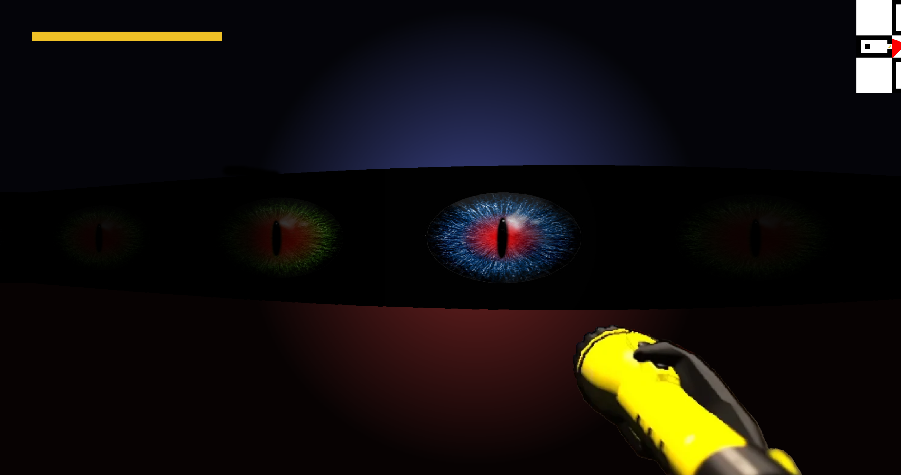

# Eyes-Cube

---

## About

**Eyes-Cube** is a first-person 3D graphics engine inspired by **Wolfenstein 3D**. It is a raycasting-based game project, written in C, that renders a maze-like environment from a first-person perspective. The engine uses the **MiniLibX** graphical library for windowing and rendering, and it leverages a custom **libft** for common utility functions. The project implements the core features of the 42 school’s **Cub3D** assignment, with bonus enhancements such as interactive enemies and other extended gameplay elements.

---

## Installation & Usage

### Requirements

* **Libft**
* **MiniLibX**

### Building the Program

```bash
# Clone the repository
git clone https://github.com/Hellisabd/Eyes-Cube.git
cd Eyes-Cube
make mlx_init
make
```

### Running the Program

```bash
./cub3D path/to/map.cub
```

---

## Main Project Instructions

### Mandatory

* Written **only in C** and built with a dedicated **Makefile** (`make && ./cub3D`).
* Must comply with the **Norminette** coding style.
* **No memory leaks** (Valgrind must stay silent).
* Uses only **authorized functions** (42 whitelist).
* Implements:

  * Map parsing from `.cub` file
  * Textured wall rendering using **raycasting**
  * Player movement and rotation
  * Basic sprite rendering

### Bonus

* **Enemies** rendered as interactive sprites
* **Minimap** displayed on screen
* **Doors** that open/close via player interaction
* Other enhancements: smoother movement, additional sprites, improved UI

---

## Architecture (High‑level)

### Parsing

Loads and validates `.cub` configuration files including textures, colors, and map layout. Ensures the map is enclosed and has exactly one player start.

### Texture Handling

Loads wall and sprite textures via MiniLibX. Applies correct slices of textures based on raycasting calculations.

### Raycasting

For each screen column, casts rays to detect walls, calculates distance, and draws vertical slices accordingly. Handles fish-eye correction and basic perspective.

### Entities

Includes dynamic elements like:

* **Enemies**: Sprites that move/chase/interact with the player.
* **Doors**: Open/close logic tied to keypresses.
* **Other objects** handled via entity update loop and rendered appropriately.

---

## Notes

* The project is fully functional and meets 42's Cub3D requirements.
* Bonus features enhance gameplay beyond the scope of the base project.
* While performance and modularity are good, some optimizations remain possible.
* **Eyes-Cube** demonstrates core concepts of a 3D game engine built from scratch using raycasting and low-level graphics programming.

---

Enjoy! 🎉

<br><br>
